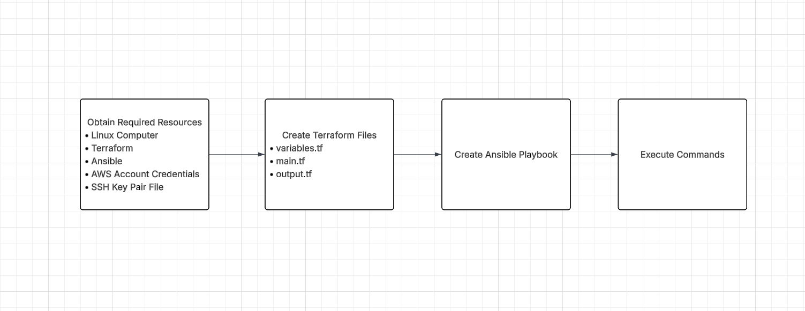
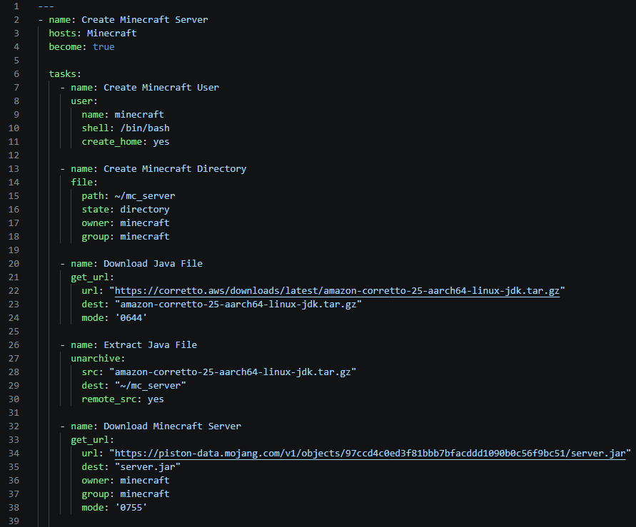
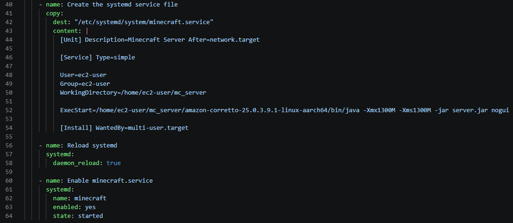

# Background
The purpose of this repository is to automate the process of configuring and creating an AWS EC2 instance, as well as downloading and configuring the resources required to create and start up a Minecraft server. This will be accomplished by using Terraform and Ansible files to automate these steps. Specifically, the process of creating the AWS EC2 instance will be accomplished through Terraform files, and the process of creating the Minecraft server will be accomplished through an Ansible playbook and a supporting inventory.ini file. 
# Requirements
For the repository to function properly, the following is required to have:
* A computer with a Linux operating system
* Terraform installed on the computer
* Ansible installed on the computer
* AWS account credentials
* An SSH key pair file (e.g. Minecraft_Key.pem)
# Diagram

## Terraform Files
### variable.tf
The variable.tf file is written with the following commands:
>     variable "ami_id" {
>       description = "AMI ID for the EC2 instance (Ubuntu 26.04 in us-east-1)"
>       type        = string
>       default     = "ami-0d13e2317a7e75c95"
>     }
>     variable "instance_type" {
>       description = "EC2 instance type"
>        type        = string
>        default     = "t4g.small"
>     }
>     variable "Minecraft_Key" {
>       description = "Name of the SSH key pair (must already exist in AWS)"
>       type        = string
>       default     = "Minecraft_Key.pem"
>     }

This establishes the following variables:
* **AMI ID**: This determines the operating system the instance uses
* **Instance type**: This determines the type of instance the EC2 instance will be
* **Mincraft Key**: This determines the name of the SSH key pair file

These variables will be used in the main.tf file.
### main.tf
The main.tf file is written with the following commands:
>     terraform {
>       required_providers {
>         aws = {
>           source  = "hashicorp/aws"
>           version = "~> 5.0"
>         }
>       }
>     }
>
>     provider "aws" {
>       region = "us-east-1"
>     }
> 
>     data "aws_vpc" "default" {
>       default = true
>     }
>
>     resource "aws_security_group" "minecraft" {
>       name        = "Minecraft Security Group"
>       vpc_id      = data.aws_vpc.default.id
>
>       ingress {
>         from_port   = 22
>         to_port     = 22
>         protocol    = "tcp"
>         cidr_blocks = ["0.0.0.0/0"]
>       }
>
>       ingress {
>         from_port   = 25565
>         to_port     = 25565
>         protocol    = "tcp"
>         cidr_blocks = ["0.0.0.0/0"]
>       }
>
>       egress {
>         from_port   = 0
>         to_port     = 0
>         protocol    = "-1"
>         cidr_blocks = ["0.0.0.0/0"]
>       }
>     }
>
>     resource "aws_instance" "minecraft" {
>       ami                    = var.ami_id
>       instance_type          = var.instance_type
>       key_name               = var.key_name
>       vpc_security_group_ids = [aws_security_group.control.id]
>       iam_instance_profile   = "InstanceProfile"
>
>       tags = {
>         Name = "minecrat_server"
>       }
>     }
>
>     resource "local_file" "ansible_inventory" {
>     content = "[Minecraft]\n${aws_instance.minecraft_server.public_ip} ansible_user=ec2-user ansible_ssh_private_key_file=~\mc_server"
>     filename = "inventory.ini"
>     }

This is what each block does:
* **Terraform** - Specifies the provider to use
* **Provider** - Lists specific details of the provider
* **Data** - Reads the existing VPC without creating it
* **resource "aws_security_group" "minecraft_group"** - Creates the security group of the instance, specifying open ports
* **resource "aws_instance" "minecraft_instance"** - Establishes the details of the AWS EC2 instance
* **resource "local_file" "ansible_inventory"** - Creates the inventory.ini file to be used by the Ansible playbook
### outputs.tf
The outputs.tf file is written with the following commands:
>     output "public_ip" {
>       value       = aws_instance.minecraft_server.public_ip
>     }

This block outputs the public IP of the instance to the terminal.
## Ansible Playbook
The Ansible playbook, *playbook.yml*, is written with the following commands:

This is what each block does:
* **Create Minecraft Server** - References the Minecraft group in the inventory.ini file and enables the tasks to be ran with sudo (admin privileges)
* **Create Minecraft User** - Creates user to associate with the directory and server
* **Create Minecraft Directory** - Creates the Minecraft directory and associates the owner and group
* **Download Java File** - Retrieves the java file from the provided link and downloads it to the specified destination and establishes permissions for the file
* **Extract Java File** - Extracts the file to the specified destination and tells ansible that the file is already on the host so that it doesn't get retrieved again
* **Download Minecraft Server** - Retrieves the server file from the provided link and downloads it to the specified destination while also establishing the owner, group, and permissions
* **Create the systemd file** - Creates the *minecraft.service* file and writes the following commands to the file:
>     [Unit] Description=Minecraft Server After=network.target
>
>     [Service] Type=simple
>
>     User=ec2-user
>     Group=ec2-user
>     WorkingDirectory=/home/ec2-user/mc_server
>
>     ExecStart=/home/ec2-user/mc_server/amazon-corretto-25.0.3.9.1-linux-aarch64/bin/java -Xmx1300M -Xms1300M -jar server.jar nogui
>
>     [Install] WantedBy=multi-user.target

* **Reload systemd** - Reload systemd to ensure its working
* **Enable minecraft.service** - Enables the systemd file to automatically start up the Minecraft server
## Execution Commands
**Terraform:**
> terraform init

This command creates the directory that stores the Terraform plugins
> terraform plan -var="key_name=Minecraft_key.pem"

This command shows what the terraform files will output before executing the command
> terraform apply -var="key_name=Minecraft_key.pem"

This command shows the plan again and asks for confirmation. When yes is typed into the terminal, the plan is executed.

**Ansible:**
> ansible-playbook -i inventory.ini playbook.yml

This command executes the playbook while also referencing the inventory.ini file

**Nmap:**
> nmap -sV -Pn -p T:25565 <instance_public_ip>

This command connects to the Minecraft server instance with nmap

## How to connect to the server from the Minecraft client
* Open your Minecraft client, select **Multiplayer**, then select the **Direct Connection** button
* Type in the elastic IP, then press the **Join Server** button

## Resources
* https://cs312.alexulbrich.com/labs/first-infrastructure-stack/
* https://cs312.alexulbrich.com/labs/automated-configuration-and-deployment/
* https://www.minecraft.net/en-us/download/server
* My Course Project Part 1 Submission
* ChatGPT
